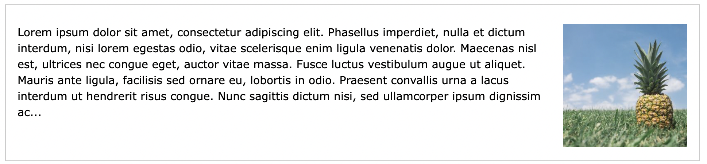
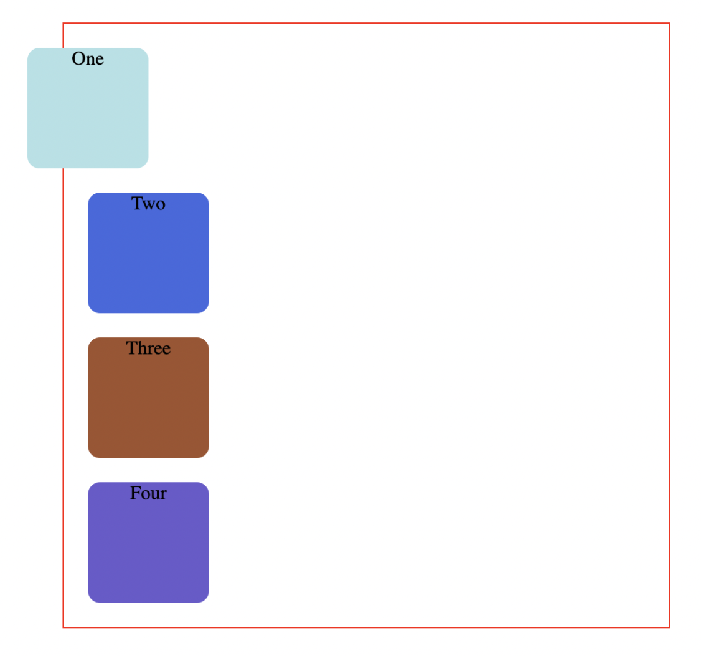
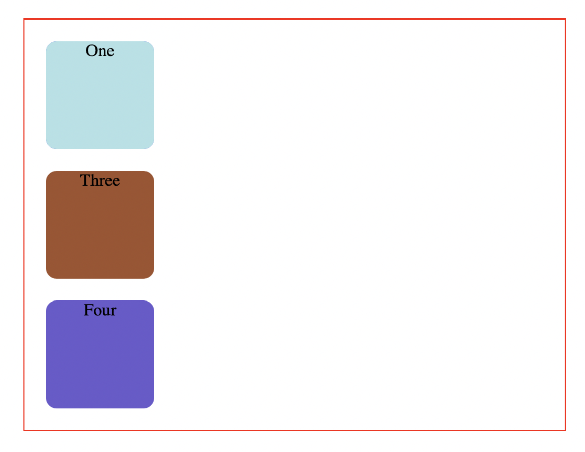
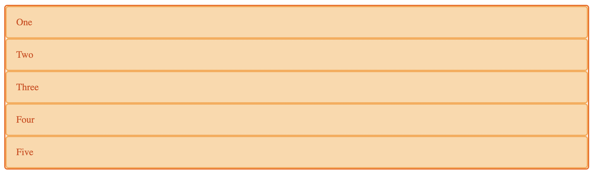
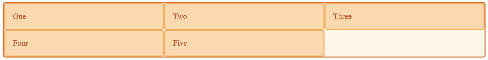

# HTML Styles - CSS

CSS stands for Cascading Style Sheets.

CSS saves a lot of work. It can control the layout of multiple web pages all at once.

With CSS, you can control the color, font, the size of text, the spacing between elements, how elements are positioned and laid out, what background images or background colors are to be used, different displays for different devices and screen sizes, and much more!

> The word ***cascading*** means that a style applied to a parent element will also apply to all children elements within the parent. So, if you set the color of the body text to "blue", all headings, paragraphs, and other text elements within the body will also get the same color (unless you specify something else)!

## Using CSS
CSS can be added to HTML documents in 3 ways:

- Inline - by using the style attribute inside HTML elements
- Internal - by using a `<style>` element in the `<head>` section
- External - by using a `<link>` element to link to an external CSS file

> The most common way to add CSS, is to keep the styles in external CSS files. However, in this tutorial we will use inline and internal styles, because this is easier to demonstrate, and easier for you to try it yourself.

### **Example of how to use CSS**

#### **Inline CSS**

An inline CSS uses the `style` attribute of an HTML element.


```HTML
<h1 style="color:blue;">A Blue Heading</h1>

<p style="color:red;">A red paragraph.</p>
```


#### **Internal CSS**
An internal CSS is defined in the `<head>` section of an HTML page, within a `<style>` element.

```HTML
<!DOCTYPE html>
<html>
  <head>
    <style>
      body {background-color: powderblue;}
      h1   {color: blue;}
      p    {color: red;}
    </style>
  </head>
  <body>

    <h1>This is a heading</h1>
    <p>This is a paragraph.</p>

  </body>
</html>
```

#### **External CSS**
To use an external style sheet, add a link to it in the `<head>` section of each HTML page:


```HTML
<!DOCTYPE html>
<html>
  <head>
    <link rel="stylesheet" href="styles.css">
  </head>
  <body>

    <h1>This is a heading</h1>
    <p>This is a paragraph.</p>

  </body>
</html>
```

## CSS Selectors

In CSS, selectors are patterns used to select the element(s) you want to style.

There are multiple way to select an element using css we alread know 2 of then `class` and `id` selector, but we can also select the element by tag name, like if I want to select paragraph I can simplly type only `p` and it will select all p elements

```CSS
p {
  color: #ddd /* Gray color */
}
```

We can also select an element inside another element to specify what exactlly to select for example you can select `p` inside an element with class for example called `.address`

```CSS
.address p {
  font-size: 20px
}
```

Also there is another way to select element using something called ***Pseudo-classes*** 

***What are Pseudo-classes?***

A pseudo-class is used to define a special state of an element.

For example, it can be used to:

- Style an element when a user mouses over it
- Style visited and unvisited links differently
- Style an element when it gets focus

```CSS 
selector:pseudo-class {
  property: value;
}
```

For more information about the selectors and Pseudo class check the references.


---

## CSS Layout

### **float and clear**

The CSS `float` property specifies how an element should `float`.

The CSS `clear` property specifies what elements can `float` beside the cleared element and on which side.

#### The float Property
The `float` property is used for positioning and formatting content e.g. let an image `float` left to the text in a container.

The `float` property can have one of the following values:

- `left` - The element floats to the left of its container
- `right` - The element floats to the right of its container
- `none` - The element does not `float` (will be displayed just where it occurs in the text). This is default
- `inherit` - The element inherits the `float` value of its parent

In its simplest use, the `float` property can be used to wrap text around images.



```CSS
img {
  float: right;
}
```
---

## Helpfull links
- [CSS Selectors](https://www.w3schools.com/cssref/css_selectors.asp)
- [CSS Pseudo Classes](https://www.w3schools.com/css/css_pseudo_classes.asp)
- [CSS Float and Clear Explained How does CSS float and clear work?
](https://www.youtube.com/watch?v=xara4Z1b18I)
- [CSS Float](https://www.youtube.com/watch?v=xIJvkm-CgFQ)

---


## CSS color Property
The color property in CSS is used to set the color to text, the background of the webpage, and also to set the color of borders.

### Property Values:

1. color: It will set the color to the text which the programmer specifies in the CSS file. The color can be set to the text in 4 forms-
2. color-name: By directly specify the name of the color like blue, green, yellow, white, black, etc.

```CSS
color: name-of-the-color; 
```

3. RGB/RGBA Value: Here R stands for Red, G stands for Green, and B stands for Blue. The color will be assigned to the text by using the range of these values. These values range from 0 to 255.

```CSS
color: RGB(value, value, value);
```

4. Hexa-Decimal Value: It represents the value of the color in hexadecimal format. It should start with the prefix #. These values ranges from #000000 to #FFFFFF.

```CSS
color: #RRGGBB;
```

Same thing goes for the Background, also takes the three values color name, hex color, rgb

```CSS
background-color: #000;
background-color: red;
background-color: rgb(125, 23, 43);
```

---

### font-size
There are several ways to specify the font size, including keywords or numerical values for pixels or ems. Choose the appropriate method based on the needs of the particular web page.

```CSS
p {
  font-size: 20px;
}
```
---

### font-weight
The `font-weight` CSS property sets the weight (or boldness) of the font. The weights available depend on the font-family that is currently set.

```CSS
/* Keyword values */
font-weight: normal;
font-weight: bold;

/* Keyword values relative to the parent */
font-weight: lighter;
font-weight: bolder;

/* Numeric keyword values */
font-weight: 100;
font-weight: 200;
font-weight: 300;
font-weight: 400;// normal
font-weight: 500;
font-weight: 600;
font-weight: 700;// bold
font-weight: 800;
font-weight: 900;

/* Global values */
font-weight: inherit;
font-weight: initial;
font-weight: revert;
font-weight: unset;

```

| Value |	Common weight name |
|-------|--------------------|
| 100 |	Thin (Hairline) |
| 200 |	Extra Light (Ultra Light) |
| 300 |	Light |
| 400 |	Normal (Regular) |
| 500 |	Medium |
| 600 |	Semi Bold (Demi Bold) |
| 700 |	Bold |
| 800 |	Extra Bold (Ultra Bold) |
| 900 |	Black (Heavy) |
| 950 |	Extra Black (Ultra Black) |

---

### Box model
In CSS, the term "box model" is used when talking about design and layout.

The CSS box model is essentially a box that wraps around every HTML element. It consists of: margins, borders, padding, and the actual content. The image below illustrates the box model:


- Content - The content of the box, where text and images appear
- Padding - Clears an area around the content. The padding is transparent
- Border - A border that goes around the padding and content
- Margin - Clears an area outside the border. The margin is transparent


> Important: When you set the width and height properties of an element with CSS, you just set the width and height of the 

> content area. To calculate the full size of an element, you must also add padding, borders and margins.

```CSS
div {
  width: 320px;
  padding: 10px;
  border: 5px solid gray;
  margin: 0;
}
```

320px (width)

+20px (left + right padding)

+10px (left + right border)

+0px (left + right margin)

= 350px

---

### Border
The `border` shorthand CSS property sets an element's border. It sets the values of `border-width`, `border-style`, and `border-color`.

```CSS
p {
  border: 1px solid #000
}
```

**Border style**

- `dotted` - Defines a dotted border
- `dashed` - Defines a dashed border
- `solid` - Defines a solid border
- `double` - Defines a double border
- `groove` - Defines a 3D grooved border. The effect depends on the border-color value
- `ridge` - Defines a 3D ridged border. The effect depends on the border-color value
- `inset` - Defines a 3D inset border. The effect depends on the border-color value
- `outset` - Defines a 3D outset border. The effect depends on the border-color value
- `none` - Defines no border
- `hidden` - Defines a hidden border

---

# CSS Positioning – Position Absolute and Relative

When you want to design complex layouts, you'll need to change the typical document flow and override the default browser styles.

This property takes in five values: `static`, `relative`, `absolute`, `fixed`, and `sticky`.

By default, the position property for all HTLM elements in CSS is set to `static`. This means that if you don't specify any other position value or if the position property is not declared explicitly, it'll be `static`.

What if you wanted to move the first square a bit towards the left of the page – how would you do that?

There are offset properties to do so, like top, bottom, right and left.

These properties have no effect on `position:static`.


**What is position `relative` in CSS?**

`position:relative` works the same way as `position:static`;, but it lets you change an element's position.

But just writing this CSS rule alone will not change anything.

To modify the position, you'll need to apply the `top`, `bottom`, `right`, and `left` properties mentioned ealrier and in that way specify where and how much you want to move the element.

```CSS
.one {
    background-color:powderblue;
    position:relative;
    right:50px;
}
```



Here, the square has moved `50px` from the left of where it was supposed to be by default.

`position:relative`; changes the position of the element relative to the parent element and relative to itself and where it would usually be in the regular document flow of the page. This means that it's relative to its original position within the parent element.

---
**What is position absolute in CSS?**

```CSS
.one {
    background-color:powderblue;
    position:absolute;
}
```



> **This is unexpected behavior. The second square has completely disappeared.**


If you also add some offset properties like this:

```css
.one {
    background-color:powderblue;
    position:absolute;
    top: 50px;
    left:0;
}
```


Well now the square has completely abandoned it's parent.

Absolute-positioned elements are completely taken out of the regular flow of the webpage.

They are not positioned based on their usual place in the document flow, but based on the position of their ancestor.

---

**Fixed position**

This position with set the element in a specific position that is refering to the browser itself it won't be effected by the parent element, you can see alot of example for it in website like the back to top button on bottom left or bottom right, depend on the language

```css
.element {
  position: fixed;
  top: 0;
  left: 0;
}
```


---

**Sticky position**

`Sticky` positioning is a hybrid of relative and fixed positioning. The element is treated as relative positioned until it crosses a specified threshold, at which point it is treated as fixed positioned.

```css
header {
  position: sticky;
  top: 10px;
}
```


---

### **Helpfull Resources**
- [Using CSS Position Sticky](https://www.youtube.com/watch?v=0WXViWctwks)
- [Understanding CSS Position](https://www.youtube.com/watch?v=fmlvXZztXuw)
- [CSS Position](https://css-tricks.com/almanac/properties/p/position/)
- [CSS Layout - The position Property](https://www.w3schools.com/css/css_positioning.asp)

---

# CSS Display Grid, Flex
Grid today is the best system for the front-end developers, because it can be manpulated easily, and today it's the best practic for doing the responsive design, you can control where the element will be in using rows and columns.


## Grid
A grid is a set of intersecting horizontal and vertical lines defining columns and rows. Elements can be placed onto the grid within these column and row lines. CSS grid layout has the following features:

You can place items into a precise location on the grid using line numbers, names or by targeting an area of the grid. Grid also contains an algorithm to control the placement of items not given an explicit position on the grid.

### The Grid container
We create a grid container by declaring `display: grid` or `display: inline-grid` on an element. As soon as we do this, all direct children of that element become grid items.

```html
<div class="wrapper">
  <div>One</div>
  <div>Two</div>
  <div>Three</div>
  <div>Four</div>
  <div>Five</div>
</div>
```

```css
.wrapper {
  display: grid;
}
```



If you want to check the grid element in the browser from the `inspect` 


You can controll how many columns and rows do you want, using something called template

```css
grid-template-columns /* how many column do you need */
grid-template-columns: 20px 20px; /* this is mean you have two columns each one 20px width */

grid-template-rows /* how many row do you need */
grid-template-rows: 120px 220px; /* this is mean you have two columns first one 120px width and the second one 220px*/
```

So simplly you can design you webpage as you like 

You can also control how many column for example the element will reserve like I need the element to take the 3 columns all you need to do is use another property for the Grid called `grid-column` also rows can be the same `grid-row`, now to use this property you need to know exactly how the grid distribute the column, once you use grid the browser will start the columns from 1 to how many column you had, for example if you have 3 column then it will start from 1 to 4, why it's not 3 because it's the end of the column, same goes for rows

**example**

```html
<div class="wrapper">
  <div class="one">One</div>
  <div>Two</div>
  <div>Three</div>
  <div>Four</div>
</div>
```

```css
.wrapper {
  display: grid;
  grid-template-columns: 200px 200px 200px;
}

.one {
  grid-column: 1 / 4;
  /* grid-column: 1 / -1; */
}
```


### The fr unit
Tracks can be defined using any length unit. Grid also introduces an additional length unit to help us create flexible grid tracks. The new `fr` unit represents a `fraction` of the available space in the grid container. The next grid definition would create three equal width tracks that grow and shrink according to the available space.

```html
<div class="wrapper">
  <div>One</div>
  <div>Two</div>
  <div>Three</div>
  <div>Four</div>
  <div>Five</div>
</div>
```

```css
.wrapper {
  display: grid;
  grid-template-columns: 1fr 1fr 1fr;
}
```



---

## Flex
The Flexible Box Layout Module, makes it easier to design flexible responsive layout structure without using float or positioning.


```css
.container {
  display: flex; /* or inline-flex */
}
```

>Note that CSS columns have no effect on a flex container.

**flex-direction**
This establishes the main-axis, thus defining the direction flex items are placed in the flex container. Flexbox is (aside from optional wrapping) a single-direction layout concept. Think of flex items as primarily laying out either in horizontal rows or vertical columns.


```css
.container {
  flex-direction: row | row-reverse | column | column-reverse;
}
```

- row (default): left to right in ltr; right to left in rtl
- row-reverse: right to left in ltr; left to right in rtl
- column: same as row but top to bottom
- column-reverse: same as row-reverse but bottom to top


**justify-content**

This defines the alignment along the main axis. It helps distribute extra free space leftover when either all the flex items on a line are inflexible, or are flexible but have reached their maximum size. It also exerts some control over the alignment of items when they overflow the line.


**align-items**

This defines the default behavior for how flex items are laid out along the cross axis on the current line. Think of it as the justify-content version for the cross-axis (perpendicular to the main-axis).


---
- [CSS Grid](https://www.w3schools.com/css/css_grid.asp)

---

# Responsive Web Design - Media Queries

Media query is a CSS technique introduced in CSS3.

It uses the `@media` rule to include a block of CSS properties only if a certain condition is true.

```css
@media only screen and (max-width: 600px) {
  body {
    background-color: lightblue;
  }
}
/* If the browser window is 600px or smaller, the background color will be lightblue */
```

Insted of `max-width` you can use `min-width`

## Viewport

The viewport is the user's visible area of a web page.

The viewport varies with the device, and will be smaller on a mobile phone than on a computer screen.

### Setting The Viewport
HTML5 introduced a method to let web designers take control over the viewport, through the `<meta>` tag.

You should include the following `<meta>` viewport element in all your web pages:

```html
<meta name="viewport" content="width=device-width, initial-scale=1.0">
```
> Without this line in your HTML the @media query won't work

### Always Design for Mobile First

Mobile First means designing for mobile before designing for desktop or any other device (This will make the page display faster on smaller devices).

This means that we must make some changes in our CSS.

Instead of changing styles when the width gets smaller than 768px, we should change the design when the width gets larger than 768px. This will make our design Mobile First:

```css
/* For mobile phones: */
[class*="col-"] {
  width: 100%;
}

@media only screen and (min-width: 768px) {
  /* For desktop: */
  .col-1 {width: 8.33%;}
  .col-2 {width: 16.66%;}
  .col-3 {width: 25%;}
  .col-4 {width: 33.33%;}
  .col-5 {width: 41.66%;}
  .col-6 {width: 50%;}
  .col-7 {width: 58.33%;}
  .col-8 {width: 66.66%;}
  .col-9 {width: 75%;}
  .col-10 {width: 83.33%;}
  .col-11 {width: 91.66%;}
  .col-12 {width: 100%;}
}
```

> You can also specify the orientation (landscape, portrait)

```css
body {
  width: 100%
}

@media only screen and (orientation: landscape) {
  body {
    width: 90%;
  }
}
```

### Typical device brackpoint
```css
/* Extra small devices (phones, 600px and down) */
@media only screen and (max-width: 600px) {}

/* Small devices (portrait tablets and large phones, 600px and up) */
@media only screen and (min-width: 600px) {}

/* Medium devices (landscape tablets, 768px and up) */
@media only screen and (min-width: 768px) {}

/* Large devices (laptops/desktops, 992px and up) */
@media only screen and (min-width: 992px) {}

/* Extra large devices (large laptops and desktops, 1200px and up) */
@media only screen and (min-width: 1200px) {}
```